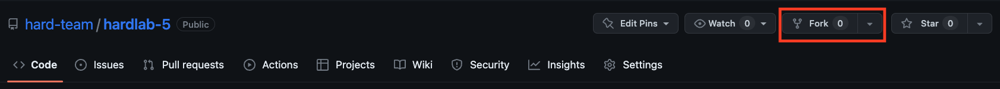

# Потік роботи даного проекту

У нас є головна гілка програми (main), де зберігатимуться лише готові, робочі версії нашої програми.

Основна робота відбуватиметься на гілці розробки (develop), куди ми додаватимемо наші зміни та напрацювання.

Щоби внести зміну до коду програми необхідно створити нову гілку `git checkout -b <branch-name>`, яка матиме вигляд `(feature/* | bug-fix/*)` та працювати вже безпосередньо на ній. Чим частіше Ви створюватимете коміти, тим краще, не нехтуйте детальним описом, щоб інші могли розібратися у Вашому коді. Після завершення роботи буде необіхдно створити Pull Request.


## Як правильно надсилати зміни до головного репозиторію

Спочатку робимо копію (fork) головного (upstream) репозиторію до свого GitHub акаунта



Не забуваємо вимкнути main-only опцію


Клонуємо репозиторій локально

(через SSH, має бути посилання на Ваш репозиторій)

```git
git clone git@github.com:hard-team/hardlab-5.git
```

Цей локальний репозиторій Ви використовуватимете для того, щоби пропонувати свої зміни в коді.

Проте щоб ваш репозиторій залишався актуальним, необхідно також встановити звʼязок з основним upstream репозиторієм.

Для цього необхідно прописати таке:

```
git remote add upstream git@github.com:hard-team/hardlab-5.git
```

Тут необхідно вказувати посилання на основний репозиторій.

Далі Ви працюєте над своїм доповненням на окремій гілці. Після того як Ви завершите роботу, Ваша версія ймовірно вже відставатиме від основної. Тому, щоб коли Ви створюватимете PR у Вас не виникало конфліктів, необіхдно спочатку зробити Ваші зміни сумісними з основним репозиторієм.

Для цього затягуємо останні зміни з upstream

```
git fetch upstream
git merge upstream/some_branch
```

Тепер коли ми маємо наявні зміни, переходимо до нашої гілки й зливаємо в неї робочу.

```
git checkout your_feature_name
git merge develop
```

Робимо саме так, щоби наша гілка перестала бути 'брудною' та стала готовою до злиття

Далі надсилаємо зміни до нашого форку

```
git push -u origin your_feauture_name
```

Після чого заходимо на GitHub до нашого форку. Там зʼявляється таке віконце


Необхідно нажати `Compare & pull request`.

Після цього відкриється вікно створення `PR`. Тут необіхдно змінити `main` гілку на `develop`, щоби ваш pull request в майбутньому був злитим саме в неї.

Якщо Ви бачите `Able to merge`, то все зроблено правильно й можна оформити Ваш PR, додавши описа та влучну назву. Якщо ж ні, то варто спочатку вирішити merge conflict, а потім повернутися до створення PR.

Нажимаєте `Create Pull Request` і Ваші зміни будуть полетіли.

## Чого не потрібно робити

Надсилати файли компліляції чи самі файли executables. Надсилайте лише зміни до коду, а результати компіляції можете додати до `.gitignore`, щоби вони ігнорувалися гітом.
